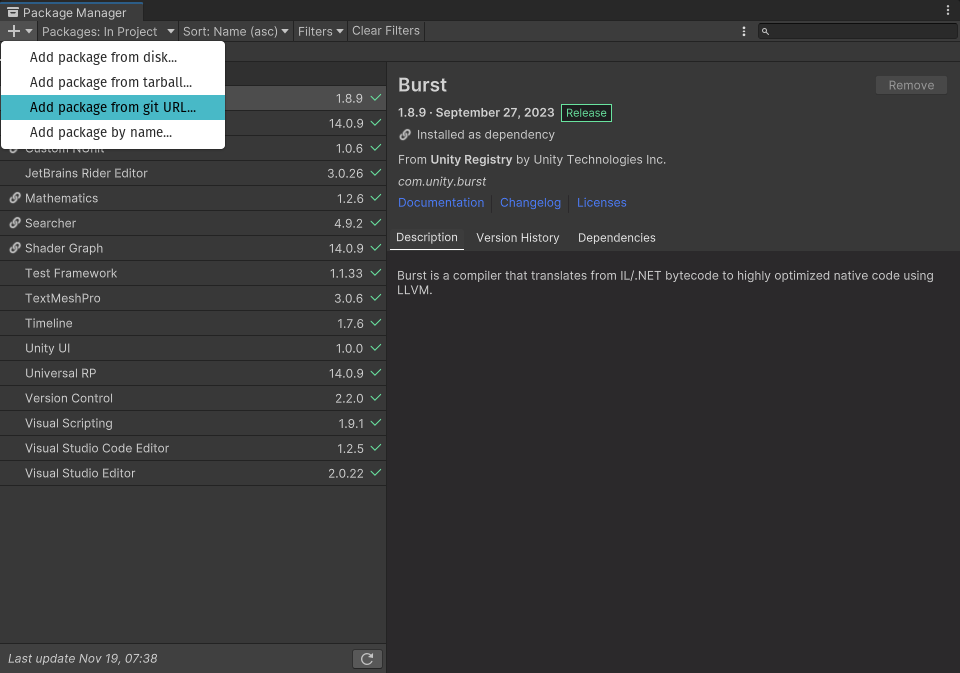
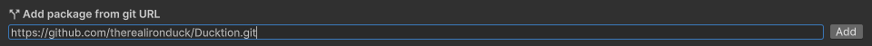

# Getting started

Ducktion is a package for [Unity3D](https://unity.com) that provides a simple way to handle
dependency injection in your project!

If you are new to dependency injection, you can read more about it
[here](https://en.wikipedia.org/wiki/Dependency_injection). If you are
a visual learner, you can watch [this video](https://www.youtube.com/watch?v=IKD2-MAkXyQ).

## Installation

Ducktion can be installed using the Unity Package Manager. Other installation methods, such as
the asset store or manual download can be found here: [Installation](/installation).

To install Ducktion using the Unity Package Manager, follow these steps:

1. In Unity, open the Package Manager window: `Window > Package Manager`
   

2. Enter the GIT URL for the Ducktion package: `https://github.com/therealironduck/Ducktion.git`:
   

3. Press `Add` and wait for the installation to finish!

## Usage

Ducktion is designed to be as simple as possible to use. You can access the container from any C# script
using `Ducktion.singleton`. If it doesn't exist, it will be created for you!

### Accessing services

Let's start by registering a service. A service is a class that you want to be able to access from anywhere
using dependency injection. For example, let's say we have a class called `Player` that we want to access from
anywhere in our project.

By default, Ducktion uses 'Auto Resolving', meaning you don't have to manually register your services. Let's
see how you can access the `Player` class from anywhere in your project:

```csharp
using TheRealIronDuck.Ducktion.Runtime;

public class MyScript : MonoBehaviour {
    private Player _player;

    private void Start() {
        _player = Ducktion.singleton.Resolve<Player>();
    }
}
```

It will automatically create an instance of the `Player` class for you and return it. In addition it will
ensure that only one instance of the `Player` class is created. If you call `Resolve<Player>()` again, it
will return the same instance as before. Of course, you can change this behavior if you want to.
See [the documentation](/services/singleton-services) for more information.

## What now?

Ducktion offers a lot of different features and ways to manage your services. For instance, you can register
your services manually to have more fine-tuned control over how they are created.
See [the documentation](/basics/configurator-classes) for more details.

Ducktion also offers an easy-to-use, simple Event Bus system. See [the documentation](/event-bus/using-the-eventbus) for
more details.