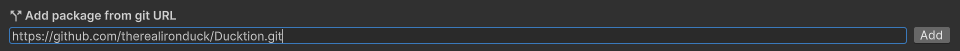

# Installation

Ducktion can be installed in multiple ways. The easiest way is to use the Unity Package
Manager. You can also download the source code and add it to your project manually. Finally,
you can download the package using the Unity Asset Store.

## Unity Package Manager

::: info
Using the Unity Package Manager is the easiest way to install Ducktion. The Unity Package Manager
provides a way to install packages directly from a Git Repository. This means that you will always
get the latest version of Ducktion and don't have to worry about updating the package manually. Also
you can easily switch between different versions of Ducktion. When working in a team, the packages
will automatically be downloaded for everyone working on the project.
:::

If you add the package using the [Unity Package Manager](https://docs.unity3d.com/Manual/upm-ui.html), you will always 
get the latest version straight from the [Git Repository](https://github.com/therealironduck/Ducktion). To add the 
package using the Unity Package Manager, follow these steps:

1. In Unity, open the Package Manager window: `Window > Package Manager`
   

2. Enter the GIT URL for the Ducktion package: `https://github.com/therealironduck/Ducktion.git`:
   

3. Press `Add` and wait for the installation to finish!

::: tip
The steps above will always install the newest available version of Ducktion. If you want to install
a specific version, you can specify the version in the URL. For example, to install version `1.0.0`,
you can use the following URL: `https://github.com/therealironduck/Ducktion.git#1.0.0`.
:::

## Manual Installation

::: info
Manual installation can be useful if you need to modify the source code of Ducktion or don't want to
use the Unity Package Manager. However, if you want to use Ducktion in a team, we recommend using the
Unity Package Manager.
:::

If you want to install Ducktion manually, you can download the source code from the
[Git Repository](https://github.com/therealironduck/Ducktion). Once you have downloaded the source code,
you can add it to your project by copying the downloaded folder to your project's `Assets` folder.

1. Download the source code from the [Git Repository](https://github.com/therealironduck/Ducktion)

2. Unzip the downloaded file
3. Copy the unzipped folder to your project's `Assets` folder

## Unity Asset Store

::: warning
We are currently in the process of submitting Ducktion to the Unity Asset Store. Once the package is available
on the Unity Asset Store, we will update this section with instructions on how to install the package using the
Unity Asset Store.
:::

## Troubleshooting

If anything goes wrong during the installation process, please let us know by creating an issue on the
[Git Repository](https://github.com/therealironduck/Ducktion/issues). Please include as much information
as possible, including the steps you have taken and any error messages you have received.

## Next Steps
Now that you have installed Ducktion, you can start using it in your project. To learn more about how to use
Ducktion, you may continue [here](./basics/).